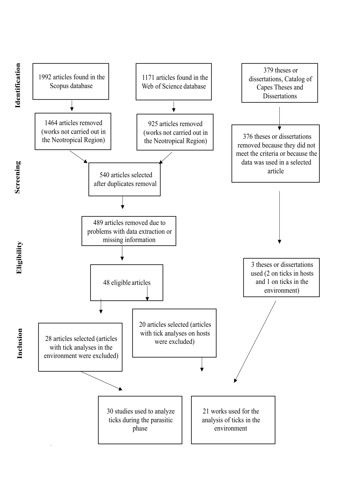

# Seasonal Dynamics of Amblyomma Ticks in the Neotropical Region

## Overview

This project presents a systematic review and meta-analysis investigating
seasonal patterns in the abundance, prevalence and intensity of Amblyomma
ticks in the Neotropical region.

The project was developed as part of my PhD research in Veterinary Sciences
at the Federal Rural University of Rio de Janeiro (UFRRJ).

## Research question

How does seasonality influence the abundance, prevalence and intensity
of Amblyomma ticks in the Neotropical region?

## Methods

- Systematic review
- Meta-analysis
- Multilevel models
- Effect-size analysis
- Statistical analysis in R
- Environmental and geographic variables

## Tools

- R
- RStudio
- Statistical modelling
- Data visualization
- Meta-analysis

## Images

## Main results

...
