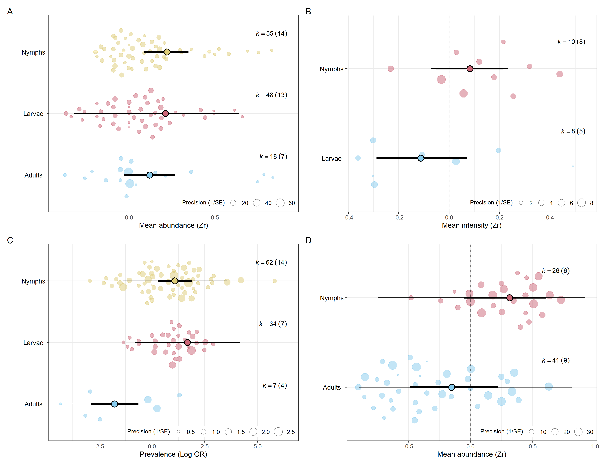
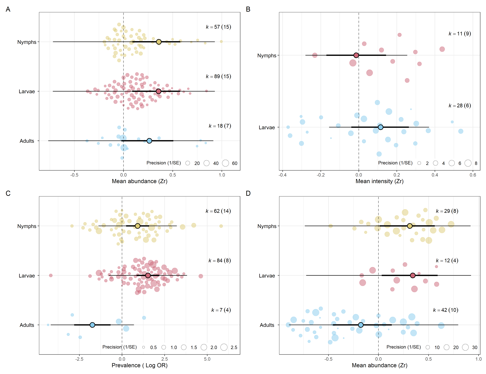
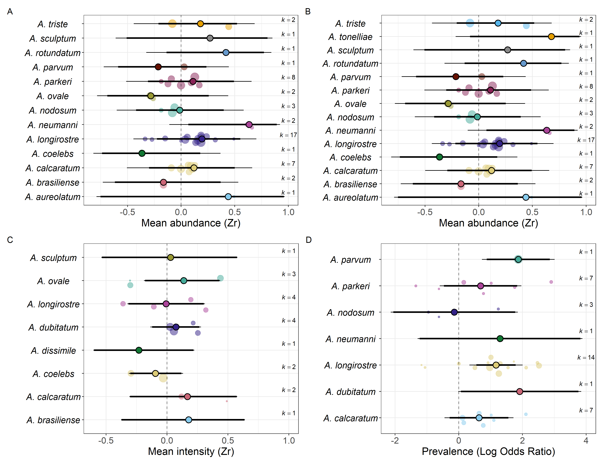
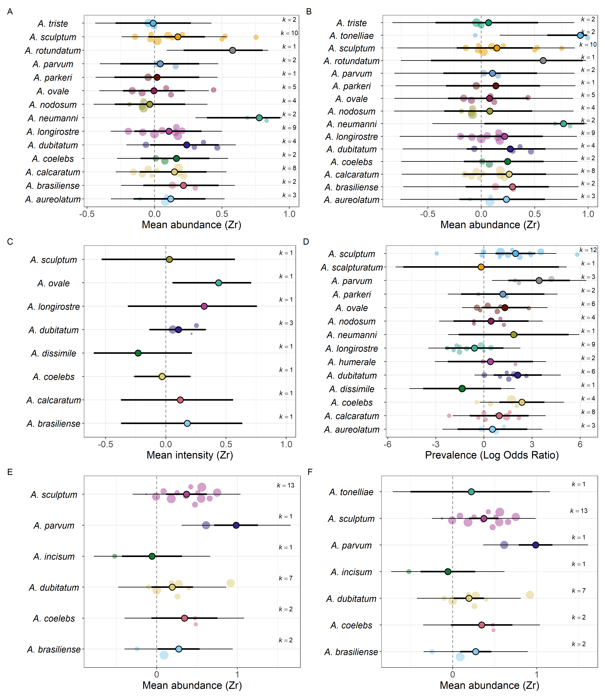
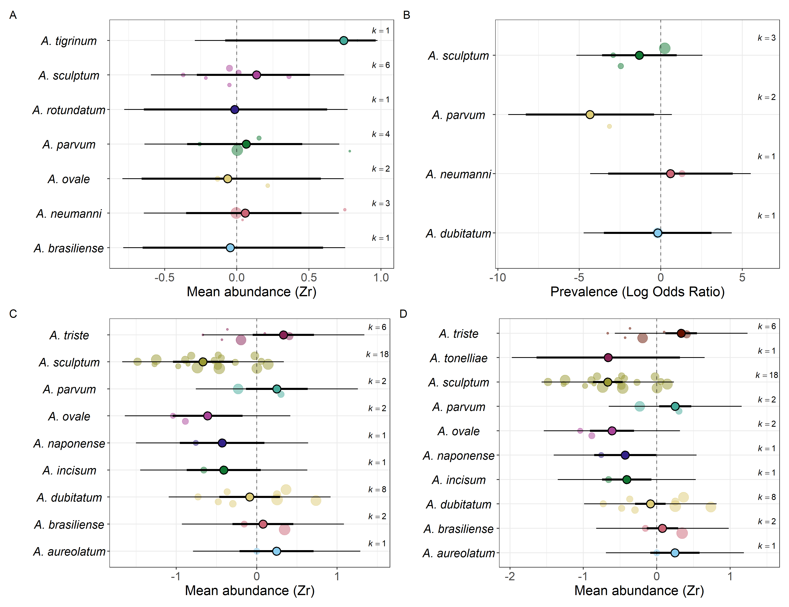

# Seasonal Dynamics of Amblyomma Ticks in the Neotropical Region

## Overview

This project presents a systematic review and meta-analysis investigating
seasonal patterns in the abundance, prevalence and intensity of Amblyomma
ticks in the Neotropical region.

The project was developed as part of my PhD research in Veterinary Sciences
at the Federal Rural University of Rio de Janeiro (UFRRJ).

## Research question

How does seasonality influence the abundance, prevalence and intensity
of Amblyomma ticks in the Neotropical region?

## Methods

- Systematic review
- Meta-analysis
- Multilevel models
- Effect-size analysis
- Statistical analysis in R
- Environmental and geographic variables

## Tools

- R
- RStudio
- Statistical modelling
- Data visualization
- Meta-analysis

## Images

**Figure 1:** PRISMA-EcoEvo protocol, including the stages of identification, screening, eligibility, and inclusion of studies based on predefined criteria.

**Figure 2:** Geographical distribution of the analyzed studies. Effect sizes were geographically concentrated in only a few countries within the studied region, mostly between latitudes 15º and 30º.

**Figure 3:** Mean effect sizes estimated by models that controlled for *Amblyomma* phylogenetic dependence. Estimates from four models are depicted: (A) mean abundance of larvae, nymphs, and adults; (B) mean intensity of larvae and nymphs; (C) prevalence of larvae, nymphs, and adults; and (D) mean abundance of adults and nymphs collected as questing ticks. *K* represents the sample size at each stage, and numbers in parentheses represent the number of species analyzed for the respective stage. The outlined circle represents the mean estimate for each life stage. Thicker lines indicate the 95% confidence interval of the mean estimate, while thinner lines represent the prediction interval. The remaining circles represent individual effect sizes extracted from the literature, with their sizes corresponding to their precision (1/standard error).

**Figure 4:** Mean effect sizes estimated by models that did not control for *Amblyomma* phylogenetic dependence. Estimates from four models are depicted: (A) mean abundance of larvae, nymphs, and adults; (B) mean intensity of larvae and nymphs; (C) prevalence of larvae, nymphs, and adults; and (D) mean abundance of adults and nymphs collected as questing ticks. *K* represents the sample size at each stage, and numbers in parentheses represent the number of species analyzed for the respective stage. The outlined circle represents the mean estimate for each life stage. Thicker lines indicate the 95% confidence interval of the mean estimate, while thinner lines represent the prediction interval. The remaining circles represent individual effect sizes extracted from the literature, with their sizes corresponding to their precision (1/standard error).

**Figure 5:** All effect sizes obtained for larvae. Estimates from four models are depicted: (A) mean abundance, controlling for phylogenetic dependence; (B) mean abundance, without controlling for phylogenetic dependence; (C) mean intensity, controlling for phylogenetic dependence; and (D) prevalence, controlling for phylogenetic dependence. *K* represents the sample size for each species. The outlined circle represents the mean estimate for each life stage. Thicker lines indicate the 95% confidence interval of the mean estimate, while thinner lines represent the prediction interval. The remaining circles represent individual effect sizes extracted from the literature, with their sizes corresponding to their precision (1/standard error).

**Figure 6:** All effect sizes obtained for nymphs. Estimates from six models are depicted: (A) mean abundance, controlling for phylogenetic dependence; (B) mean abundance, without controlling for phylogenetic dependence; (C) mean intensity, controlling for phylogenetic dependence; (D) prevalence, controlling for phylogenetic dependence; (E) nymphs collected as questing ticks, controlling for phylogenetic dependence; and (F) nymphs collected as questing ticks, without controlling for phylogenetic dependence. *K* represents the sample size for each species. The outlined circle represents the mean estimate for each life stage. Thicker lines indicate the 95% confidence interval of the mean estimate, while thinner lines represent the prediction interval. The remaining circles represent individual effect sizes extracted from the literature, with their sizes corresponding to their precision (1/standard error).

**Figure 7:** All effect sizes obtained for adults. *K* represents the sample size for each species. Estimates from four models are depicted: (A) mean abundance, controlling for phylogenetic dependence; (B) prevalence, controlling for phylogenetic dependence; (C) adults collected as questing ticks, controlling for phylogenetic dependence; and (D) adults collected as questing ticks, without controlling for phylogenetic dependence. *K* represents the sample size for each species. The outlined circle represents the mean estimate for each life stage. Thicker lines indicate the 95% confidence interval of the mean estimate, while thinner lines represent the prediction interval. The remaining circles represent individual effect sizes extracted from the literature, with their sizes corresponding to their precision (1/standard error).

## Main results

...
