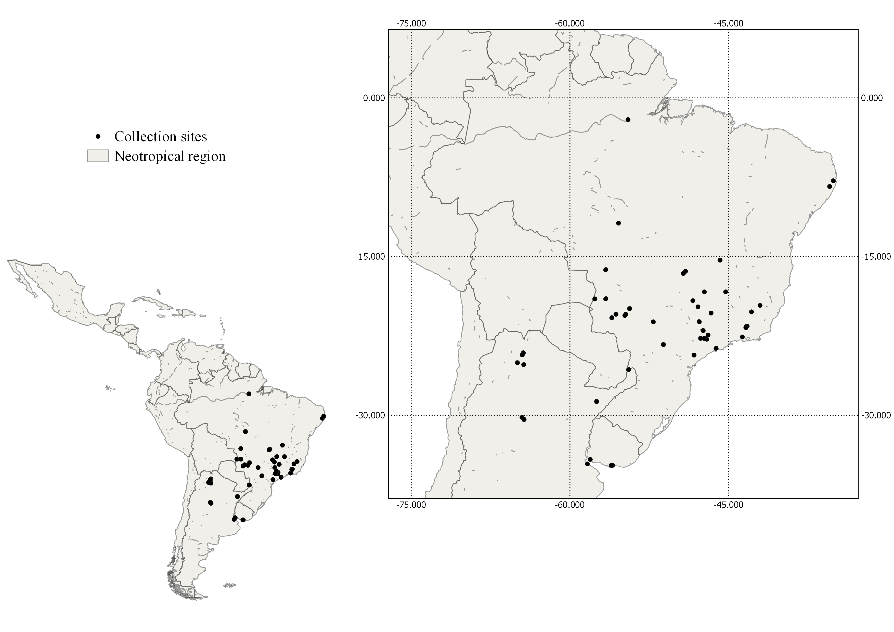

# Seasonal Dynamics of Amblyomma Ticks in the Neotropical Region

## Overview

This project presents a systematic review and meta-analysis investigating
seasonal patterns in the abundance, prevalence and intensity of Amblyomma
ticks in the Neotropical region.

The project was developed as part of my PhD research in Veterinary Sciences
at the Federal Rural University of Rio de Janeiro (UFRRJ).

## Research question

How does seasonality influence the abundance, prevalence and intensity
of Amblyomma ticks in the Neotropical region?

## Methods

- Systematic review
- Meta-analysis
- Multilevel models
- Effect-size analysis
- Statistical analysis in R
- Environmental and geographic variables

## Tools

- R
- RStudio
- Statistical modelling
- Data visualization
- Meta-analysis

## Images

**Figure 1:** PRISMA-EcoEvo protocol, including the stages of identification, screening, eligibility, and inclusion of studies based on predefined criteria.

**Figure 2:** Geographical distribution of the analyzed studies. Effect sizes were geographically concentrated in only a few countries within the studied region, mostly between latitudes 15º and 30º.

**Figure 3:** Mean effect sizes estimated by models that controlled for *Amblyomma* phylogenetic dependence. Estimates from four models are depicted: (A) mean abundance of larvae, nymphs, and adults; (B) mean intensity of larvae and nymphs; (C) prevalence of larvae, nymphs, and adults; and (D) mean abundance of adults and nymphs collected as questing ticks. *K* represents the sample size at each stage, and numbers in parentheses represent the number of species analyzed for the respective stage. The outlined circle represents the mean estimate for each life stage. Thicker lines indicate the 95% confidence interval of the mean estimate, while thinner lines represent the prediction interval. The remaining circles represent individual effect sizes extracted from the literature, with their sizes corresponding to their precision (1/standard error).

**Figure 4:** Mean effect sizes estimated by models that did not control for *Amblyomma* phylogenetic dependence. Estimates from four models are depicted: (A) mean abundance of larvae, nymphs, and adults; (B) mean intensity of larvae and nymphs; (C) prevalence of larvae, nymphs, and adults; and (D) mean abundance of adults and nymphs collected as questing ticks. *K* represents the sample size at each stage, and numbers in parentheses represent the number of species analyzed for the respective stage. The outlined circle represents the mean estimate for each life stage. Thicker lines indicate the 95% confidence interval of the mean estimate, while thinner lines represent the prediction interval. The remaining circles represent individual effect sizes extracted from the literature, with their sizes corresponding to their precision (1/standard error).

**Figure 5:** All effect sizes obtained for larvae. Estimates from four models are depicted: (A) mean abundance, controlling for phylogenetic dependence; (B) mean abundance, without controlling for phylogenetic dependence; (C) mean intensity, controlling for phylogenetic dependence; and (D) prevalence, controlling for phylogenetic dependence. *K* represents the sample size for each species. The outlined circle represents the mean estimate for each life stage. Thicker lines indicate the 95% confidence interval of the mean estimate, while thinner lines represent the prediction interval. The remaining circles represent individual effect sizes extracted from the literature, with their sizes corresponding to their precision (1/standard error).

**Figure 6:** All effect sizes obtained for nymphs. Estimates from six models are depicted: (A) mean abundance, controlling for phylogenetic dependence; (B) mean abundance, without controlling for phylogenetic dependence; (C) mean intensity, controlling for phylogenetic dependence; (D) prevalence, controlling for phylogenetic dependence; (E) nymphs collected as questing ticks, controlling for phylogenetic dependence; and (F) nymphs collected as questing ticks, without controlling for phylogenetic dependence. *K* represents the sample size for each species. The outlined circle represents the mean estimate for each life stage. Thicker lines indicate the 95% confidence interval of the mean estimate, while thinner lines represent the prediction interval. The remaining circles represent individual effect sizes extracted from the literature, with their sizes corresponding to their precision (1/standard error).

**Figure 7:** All effect sizes obtained for adults. *K* represents the sample size for each species. Estimates from four models are depicted: (A) mean abundance, controlling for phylogenetic dependence; (B) prevalence, controlling for phylogenetic dependence; (C) adults collected as questing ticks, controlling for phylogenetic dependence; and (D) adults collected as questing ticks, without controlling for phylogenetic dependence. *K* represents the sample size for each species. The outlined circle represents the mean estimate for each life stage. Thicker lines indicate the 95% confidence interval of the mean estimate, while thinner lines represent the prediction interval. The remaining circles represent individual effect sizes extracted from the literature, with their sizes corresponding to their precision (1/standard error).

## Main results

The meta-analysis synthesized evidence from 51 studies, comprising 90 effect sizes across 16 Amblyomma species.

The available evidence was geographically concentrated within a limited number of countries in the Neotropical region, with most effect sizes occurring between approximately 15º and 30º latitude.

Seasonal patterns were evaluated separately across tick life stages and response variables, including mean abundance, mean intensity, prevalence, and abundance of questing ticks.

The analysis also showed the importance of considering phylogenetic relationships among Amblyomma species when estimating overall seasonal effects. Models incorporating phylogenetic dependence were therefore compared with models that did not account for this dependence.

The results provide a quantitative synthesis of the available evidence on seasonal variation in Amblyomma populations and highlight geographic and taxonomic gaps in the current literature.

## Repository structure
.
├── README.md
├── figures/
│   ├── fig1.png
│   ├── fig2.png
│   ├── fig3A.png
│   ├── fig4A.png
│   ├── fig5A.png
│   ├── fig6A.png
│   └── fig7A.png
├── R/
│   └── analysis scripts
└── data/
    └── datasets

The exact repository structure may vary depending on the files made available with the project.

## Reproducibility

The statistical analyses were conducted in R.

The project is organized to separate data, analysis scripts, and figures, facilitating reproducibility and allowing the analytical workflow to be inspected independently.

Where permitted, the relevant datasets and R scripts are provided in this repository.

Data available on: https://osf.io/5t4rw/files/osfstorage?view_only=dfe6ff922c30404786ee1b7672d5b454

## Research relevance

This project demonstrates the application of quantitative methods to ecological and environmental data, including:

Data extraction and organization from scientific literature
Systematic review methodology
Meta-analysis
Statistical modelling
Multilevel models
Phylogenetic analysis
Geographic data interpretation
Data visualization
Reproducible analysis in R

These approaches can also be applied to broader environmental and biodiversity datasets where observations are collected across species, locations, seasons, and study designs.

## Publication

This analysis was developed as part of my PhD research in Veterinary Sciences at the Federal Rural University of Rio de Janeiro (UFRRJ).

Nascimento, R. M., Macedo-Rego, R. C., Maturano, R., & Famadas, K. M. (2025). Seasonal dynamics of Amblyomma ticks in South America: A meta-analytical approach. Acta Tropica, 263, 107552.

DOI: 10.1016/j.actatropica.2025.107552

The article presents a systematic review and meta-analysis of seasonal patterns in Amblyomma ticks, using multilevel meta-analytical models to evaluate differences among larvae, nymphs, and adults. The study found distinct seasonal patterns among life stages, with larvae and nymphs occurring more frequently during the dry season and adults predominating during the rainy season.
